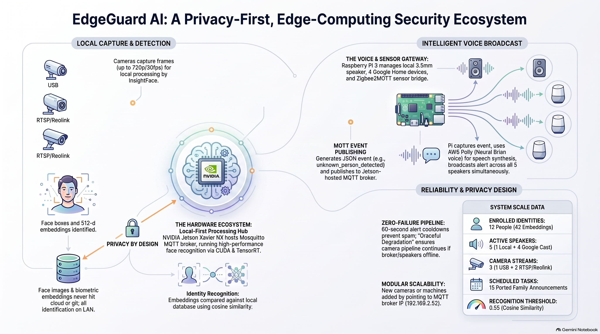

# EdgeGuardAI

### Distributed Edge AI Security Platform

Real-time computer vision, event-driven MQTT architecture, multi-sensor correlation, and privacy-preserving edge inference on NVIDIA Jetson.

**EdgeGuardAI** is a sophisticated, **privacy-focused security platform** that leverages edge computing to manage smart home automation and surveillance. The system operates by processing **biometric and sensor data locally** on hardware like the NVIDIA Jetson and Raspberry Pi, ensuring that sensitive video footage never leaves the internal network. Using an **event-driven architecture** via MQTT, the system is designed around **event correlation between camera and sensor observations** to identify individuals and trigger **automated voice announcements** through AWS Polly — Zigbee event integration is currently under development. This modular setup allows for **intelligent false-alarm suppression**, where recognised faces can silence potential security alerts automatically. Furthermore, the platform integrates **robust scheduling features** for household reminders alongside its primary protective functions. Ultimately, the project prioritises **data sovereignty and system resilience**, ensuring the security pipeline remains functional even if individual cloud services or network components fail.

<p align="center">
  
</p>

```
Camera detects & recognizes a person  →  MQTT event  →  Security decision  →  Voice announcement
                                                                                  │
                          "Security alert. An unknown person was detected        ▼
                           at the back yard."                          Pi speaker + Google Homes
```

- **Local-first**: face detection/recognition runs on an NVIDIA Jetson Xavier NX — no video leaves the LAN
- **Event-driven**: every observation becomes a structured JSON event on MQTT
- **False-alarm aware**: events are correlated (a known face nearby suppresses an "unknown" alert)
- **Audible**: AWS Polly turns decisions into speech on the Pi speaker + 4 Google Home devices
- **Fully modular**: every component is an independent service — any machine can run any piece

---

## 🔭 What It Does

| Capability | Detail |
|---|---|
| 🎥 **USB camera pipeline** | real-time face detection + recognition with a live GUI (dev machine) |
| 📷 **IP camera service** | headless Reolink RTSP monitoring — currently 2 cameras (yard, garage) |
| 🧠 **Face recognition** | insightface `buffalo_l` embeddings, cosine matching, 12 enrolled people |
| 📡 **MQTT event bus** | Jetson Mosquitto broker; `edgeguard/camera/<id>` topics, JSON events |
| 🔔 **Voice broadcaster** | AWS Polly TTS → Pi local speaker + Google Cast (4 speakers) |
| 🕐 **Scheduler** | 15 ported family announcements (school, Kumon, dishwasher…) with per-speaker targeting |
| 🚪 **Zigbee sensors** | 4 door contacts + smart plug via Zigbee2MQTT (bridge pending) |
| 🛡️ **Privacy by design** | face images/embeddings never leave the LAN or the repo |

### System Diagram

```
                    ┌──────────────────────────────────────┐
                    │  DEV MACHINE (USB camera pipeline)   │
                    │   detect → recognize → publish       │
                    └──────────────┬───────────────────────┘
                                   │  MQTT (1883)
                                   ▼
                    ┌──────────────────────────────────────┐
                    │  JETSON XAVIER NX                    │
                    │   MQTT broker (event bus)             │
                    │   Reolink camera service              │
                    │   (yard + garage → detect → recognize)│
                    └──────────────┬───────────────────────┘
                                   │  MQTT (1883)
                                   ▼
                    ┌──────────────────────────────────────┐
                    │  RASPBERRY PI                        │
                    │   Voice broadcaster (systemd)         │
                    │   AWS Polly → Pi speaker + Google Cast│
                    │   Zigbee2MQTT + own broker (Docker)  │
                    └──────────────────────────────────────┘
```

---

## ⚡ Quick Start

```bash
# 1. clone + install (dev machine)
git clone git@github.com:pparkitn/EdgeGuardAI.git && cd EdgeGuardAI
python3 -m venv .venv && .venv/bin/pip install -r requirements.txt

# 2. enroll faces (add photos to data/faces/<name>/ first)
#    Demo face images are not included in this repository.
.venv/bin/python enroll.py

# 3. start the USB camera pipeline (press q to quit)
.venv/bin/python -m face_recognition.main

# 4. watch the events bus
.venv/bin/python scripts/mqtt_monitor.py
```

Full setup, per-device runbook, and service installs: see **[Deployment](docs/deployment.md)**.

---

## 📚 Documentation

| Doc | Covers |
|---|---|
| [Getting Started](docs/getting-started.md) | venv setup, face photos, enrollment, first run |
| [Architecture](docs/architecture.md) | event lifecycle, system diagram, failure semantics, MQTT event schema |
| [Deployment](docs/deployment.md) | **per-device runbook**: Jetson (broker + camera service + systemd), Pi (broadcaster + zigbee), dev machine (USB pipeline), verification |
| [Configuration](docs/configuration.md) | central `config.yaml`, env-var overrides, requirements, repo structure |
| [Camera Service](docs/camera-service.md) | Reolink RTSP setup, ONVIF stream discovery, ffmpeg decoder, per-camera agents |
| [Voice Broadcasting](docs/voice-broadcasting.md) | Polly, speakers, delivery channels, false-alarm grace period, scheduled announcements |
| [Devices](docs/devices.md) | every device & sensor with photos and roles |
| [Architecture PDF](docs/EdgeGuard_AI_Architecture.pdf) | printable system architecture overview |
| [Development Log](docs/development-log.md) | hands-on learnings, quirks, and deployment gotchas |

---

## 🛡️ Reliability

Voice delivery is **asynchronous and isolated from MQTT processing**, with **independent local-speaker and Google Cast failure handling**:

- Announcements are handed to a background `DeliveryWorker` (queue + worker thread) — playback never blocks the MQTT callback, so events keep flowing even while audio is being delivered.
- The two output channels (Pi local speaker, Google Cast) are fully independent: each has its own enable flag, logging, and failure isolation — a speaker dropping or a cast error never affects the other channel or the event pipeline.
- External service failures (broker, Polly, speakers) degrade gracefully; hardware failures restart via systemd.

---

## 💡 Design Principles

1. **One config, every device** — `config.yaml` + env overrides; edit once, `git pull` everywhere.
2. **Events, not commands** — components only talk over MQTT with a shared JSON schema.
3. **Isolate component failures** —
   - **External service failure** (broker down, Polly down, speaker offline) → **degrade gracefully**: log, skip, retry, keep watching.
   - **Hardware/device failure** (camera disconnects, service crash) → **terminate cleanly and restart**: systemd `Restart=always` brings the service back.
4. **Privacy first** — no face data, embeddings, or credentials ever hit git or the cloud.

---

## 📊 Performance (measured)

Measured on the **NVIDIA Jetson Xavier NX** (JetPack 4.4) against live camera streams — `scripts/benchmark_jetson.py`.

| Metric | Value |
|---|---|
| Hardware | Jetson Xavier NX, CPU-only baseline (onnxruntime) — see the [Jetson GPU section](#-jetson-gpu-acceleration-jetson_gpu) below |
| Camera streams | 2 × 1080p-class (back yard + garage, processed 960×720 @ 2 FPS) |
| Face database | 12 people / 42 embeddings |
| **Detection latency** (insightface `buffalo_l`, det_size 640) | **439 ms avg / 448 ms p95** |
| **Recognition latency** (cosine, brute-force over DB) | **2.7 ms avg / 3.4 ms p95** |
| **Throughput** (full frame pipeline, single thread) | **2.29 FPS** (437 ms/frame) |
| **MQTT latency** (LAN round-trip via broker) | **9.2 ms avg / 21.0 ms p95** |
| **Memory usage** (vision pipeline incl. models) | **~750 MB** |
| **CPU utilization** (during active inference) | **~2.4 cores** (244 %) |
| System RAM (idle baseline, incl. Docker) | 1.9 GB / 7.6 GB |

Reproduce with:

```bash
ssh pparkitn@JETSON_IP 'cd ~/edgeguard && PYTHONPATH=. \
  EDGEGUARD_CAMERA_PASSWORD=... \
  ~/py38env/bin/python -u scripts/benchmark_jetson.py'
```

**Interpretation:** detection dominates the pipeline (99 % of frame time) — recognition and MQTT are negligible at this scale. Current throughput comfortably supports the configured 2 FPS processing rate. With the `jetson_gpu` TensorRT module (below) detection drops to ~50 ms on the Volta GPU.

---

## 🚀 Jetson GPU Acceleration (`jetson_gpu`)

The Jetson runs the same camera service on its **Volta GPU** via TensorRT — a self-contained module that leaves the CPU pipeline (`cameras/` + `face_recognition/`) untouched for other devices.

### How it works

- The two insightface `buffalo_l` ONNX models (`det_10g` detector, `w600k_r50` recognition) are converted to **fixed-shape fp16 TensorRT engines** with `trtexec` (`scripts/convert_engines.sh`) and executed through the `tensorrt` Python bindings + pycuda.
- Detection decode (SCRFD anchors, distance-to-bbox/keypoints, NMS) and face alignment (`norm_crop` / Umeyama) are **ported from insightface and scikit-image** into pure numpy (`jetson_gpu/scrfd.py`, `jetson_gpu/align.py`) — bit-identical math, so GPU embeddings match the CPU-enrolled database (measured cosine 0.948; recognition still resolves the right person).
- Because CUDA contexts are thread-bound in pycuda 2020.1 / TensorRT 7, all inference runs on a **dedicated GPU worker thread** (context, engine buffers and streams are created inside it); the camera agent threads simply queue frames and wait for results.
- **CPU fallback is automatic**: if the engines or `tensorrt`/`pycuda` are unavailable, `GpuFaceDetector` drops back to insightface on onnxruntime — the service never fails to start.

### Measured on-device (JetPack 4.4, live cameras, 2026-09-20)

| Metric | CPU pipeline | TensorRT GPU |
|---|---|---|
| Detect + embed latency | 439 ms avg (detect only) | **~50 ms** (43–60 ms) |
| Embedding vs CPU pipeline | — | cosine **0.948** (fp16) |
| Recognition vs enrolled DB | baseline | matches (`piotr` 0.948) |
| Service CPU (2 cameras @ 2 FPS) | ~530 % | **~270 %** |
| Live-log errors | — | 0 (stream watchdog included) |

### Deploy & run (Jetson)

```bash
# 1. ship code + build engines (trtexec; ~5 min) — or INSTALL_SERVICE=1 for systemd
CONVERT_ENGINES=1 ./scripts/deploy_cameras_gpu.sh

# 2. start the GPU service (falls back to CPU automatically)
python3 -m jetson_gpu.main        # JetPack 4.4: system python 3.6 (TRT bindings are py36-only)
```

Notes for JetPack 4.4: `pycuda` builds with `--no-build-isolation` + `CFLAGS=-I/usr/local/cuda/include`; pin `imageio-ffmpeg==0.4.9` (no `importlib.resources` on py36); `events.py` and `cameras/stream.py` are py36-compatible by design. The stream watchdog (`vision.stream_timeout`, default 15 s) reconnects silently-hung Reolink sessions.

---

## 🧩 Status

- ✅ Face recognition (USB + 2 Reolink cameras) · MQTT event bus · voice broadcast (4 speakers + Pi) · scheduler (15 announcements) · false-alarm grace · central config · systemd deployment · **TensorRT GPU camera service running live on the Jetson** (`jetson_gpu`, CPU fallback intact)
- 🔜 Zigbee → event-bus bridging/correlation · security decision engine · armed/disarmed state · dashboard · sub-stream decoding (ffmpeg CPU is now the bottleneck) · GPU service under systemd

Built on the **NVIDIA Jetson Xavier NX**, **Raspberry Pi 3**, **Reolink cameras**, **Zigbee sensors**, **Google Home speakers**, **AWS Polly**.