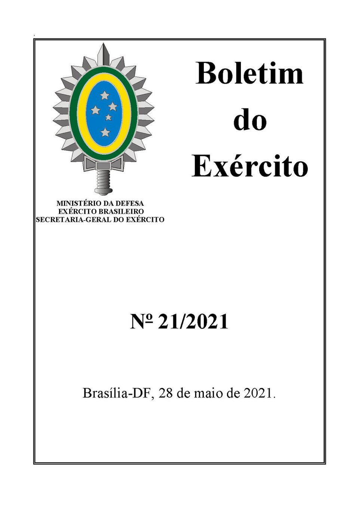
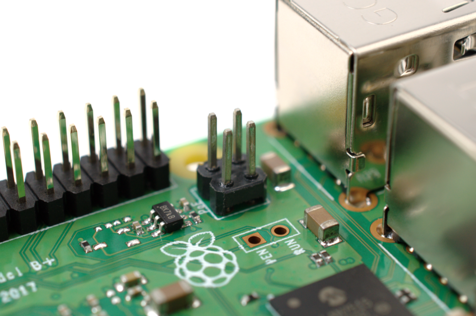
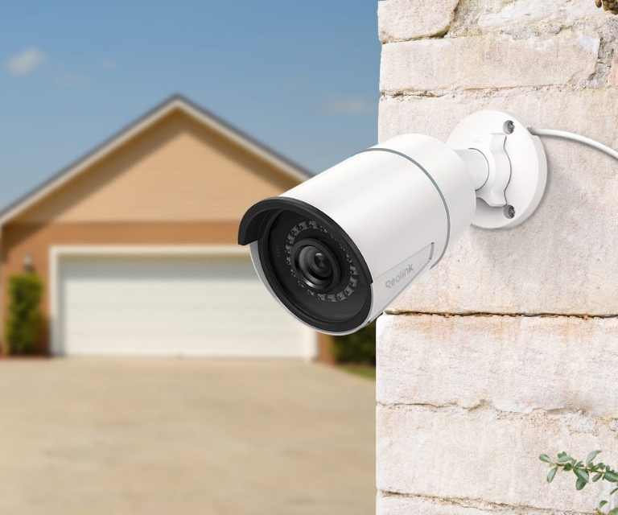
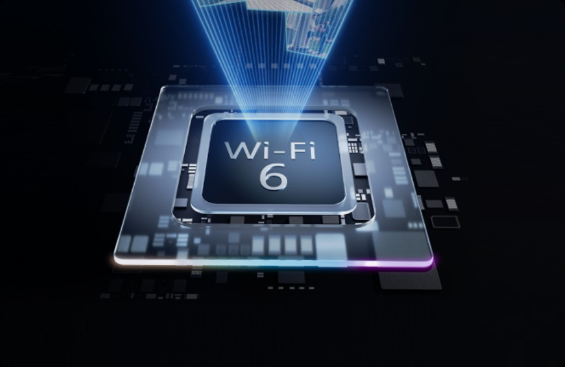
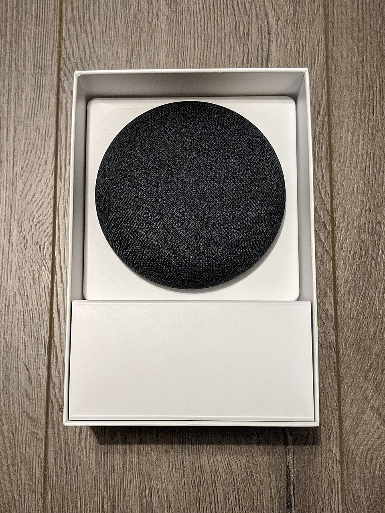
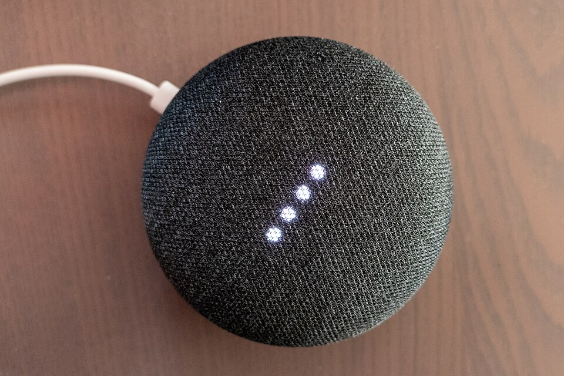
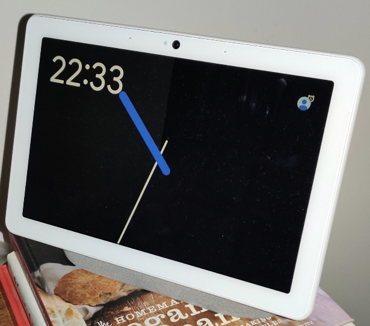
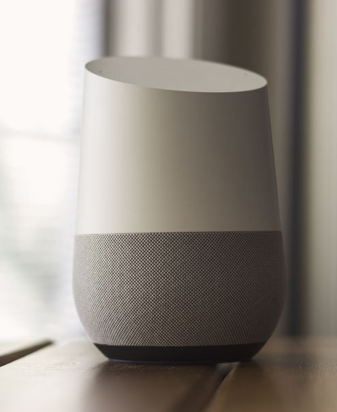
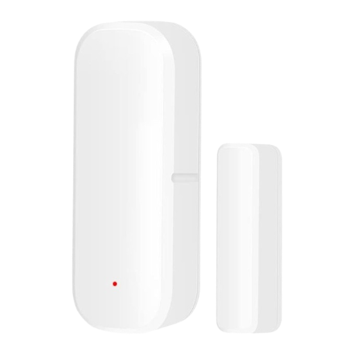

# EdgeGuard AI - Devices

> Part of the [EdgeGuard AI](../README.md) documentation.
> Everything is configured centrally in [`config.yaml`](../config.yaml).

## Devices

All hardware used by the system, grouped by role. Images: `images/` (Wikimedia Commons / manufacturer sites).

### Compute

#### NVIDIA Jetson Xavier NX

| | |
|---|---|
| IP | JETSON_IP (SSH: JETSON_USER) |
| Role | **MQTT broker** (Mosquitto, the event bus) + **Reolink camera service** (`edgeguard-cameras`) |
| Specs | JetPack 4.4 (L4T R32.4.4) · 6-core Carmel CPU · Volta GPU (384 CUDA cores) · 8 GB RAM · 1 TB NVMe root |
| Software | Ubuntu 18.04, Python 3.6 system / 3.8 in `~/py38env`, CUDA 10.2, TensorRT 7.1, Docker |

#### Raspberry Pi 3 Model B

| | |
|---|---|
| IP | PI_IP (SSH: PI_USER) |
| Role | **Voice broadcaster** (`edgeguard-voice` service) · **Zigbee2MQTT** + its own Mosquitto broker (Docker) · local audio |
| Specs | Raspbian 11 (bullseye) · 1 GB RAM · 56 GB SD · 3.5 mm audio out (bcm2835) |
| Audio | A speaker on the 3.5 mm jack (local playback via pygame) |

#### Dev machine

| | |
|---|---|
| Role | USB camera pipeline (`face_recognition.main`, GUI) · face enrollment · monitoring tools (`mqtt_monitor.py`) · deploy scripts |
| Software | Python 3.14, `.venv` with the full stack |

### Cameras

#### Reolink RLC-510A — back yard

| | |
|---|---|
| IP | YARD_CAMERA_IP (user: CAMERA_USER) |
| Stream | `rtsp://…/Preview_01_main` (H.264, 2560×1920, 30 fps; processed 960×720 @ 2 fps) |
| Role | Yard monitoring → face detection/recognition via the Jetson camera service |
| Note | 5 MP bullet camera (PoE). ONVIF paths (`Preview_01_main`/`_sub`) — see the [Camera Service](camera-service.md). |

#### Reolink RLC-410W — garage

| | |
|---|---|
| IP | GARAGE_CAMERA_IP (user: CAMERA_USER) |
| Stream | `rtsp://…/h264Preview_01_main` (H.264, 2560×1440, 30 fps; processed 1280×720 @ 2 fps) |
| Role | Garage monitoring → face detection/recognition |
| Note | 4 MP Wi-Fi dome/bullet camera (older firmware: `/h264Preview_01_main` path format). |

#### USB camera — dev machine
| | |
|---|---|
| Device | `/dev/video0` (V4L2) |
| Role | Local face recognition pipeline (`face_recognition.main`) with live GUI preview |
| Capture | 1280×720 |

### Audio

#### Pi local speaker
| | |
|---|---|
| Connection | 3.5 mm jack (bcm2835, pygame mixer) |
| Role | Primary announcement output (local channel) |

#### Google Cast speakers
| | |
|---|---|
| **Kitchen speaker** — Google Nest Mini (KITCHEN_SPEAKER_IP) | |
| **Kitchen Speaker** — Google Home Mini (KITCHEN_SPEAKER2_IP) | |
| **Natalia speaker** — Google Home Max (NATALIA_SPEAKER_IP) | |
| **Bedroom  speaker** — Google Home (BEDROOM_SPEAKER_IP) | |

   

All four are cast targets for announcements (names are exact and case-sensitive).

### Zigbee sensors (via Zigbee2MQTT on the Pi)

#### Door/window sensors — eWeLink/SONOFF DS01 (×4)

| IEEE address | Location | Battery |
|---|---|---|
| `GARAGE_DOOR_IEEE` | Garage door | 100 % |
| `MAIN_DOOR_IEEE` | Main door | **0 % — replace** |
| `BACKYARD_DOOR_IEEE` | Backyard door | reports on change |
| `SIDE_DOOR_IEEE` | Side door (test) | reports on change |

#### Smart plug — SONOFF S31 Lite ZB

| IEEE address | Location | Type |
|---|---|---|
| `WALL_PLUG_IEEE` | Wall plug | Mains-powered Zigbee router + ON/OFF control |

- Sensors publish to the Pi's broker (`PI_IP:1883`) under `zigbee2mqtt/<ieee>` — **a separate broker** from the EdgeGuard event bus (Jetson). Bridging/correlation comes later.
- Door sensors sleep and only report on state change (contact open/close, battery).
- Monitor live: `mosquitto_sub -h PI_IP -t 'zigbee2mqtt/#' -v`

> Image credits: Wikimedia Commons (Jetson, Pi 3 B+, Google speakers), Reolink.com (cameras), ITEAD/SONOFF (S31), Zigbee2MQTT docs (DS01).

---

